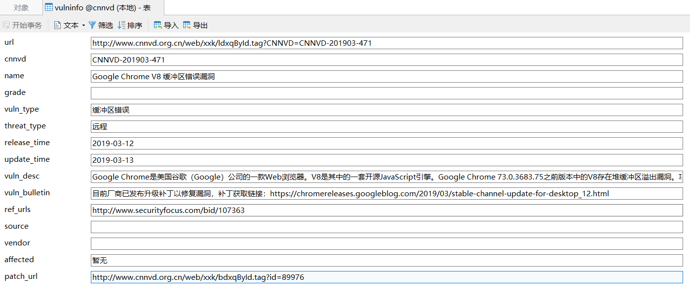

## 用法
本项目可在**Pthon2.7**下正常运行，其他版本未测试，安装依赖可执行(未测试)：
```
pip install -r requirements.txt
```
当然更建议：
```
pip install scrapy  # 安装scrapy
pip install MySQL-python # windows下可直接下载http://www.codegood.com/downloads
```
当遇到缺少的库再使用pip安装：
```
git clone git@github.com:betamaoIS/scrapy-cnnvd.git      # 下载项目
cd scrapy-cnnvd # 切换到目录
scrapy crawl mycnnvd # 运行爬虫

```



## 输出
1. scrapy内置支持将数据输出为`JSON`,`SJON lines`,`CSV`,`XML`格式如下，详见官方手册。
```
scrapy crawl mycnnvd -o items.json
scrapy crawl mycnnvd -o items.csv
scrapy crawl mycnnvd -o items.xml
```
2. 本项目添加了导出到SQL数据库的支持，首次运行需要配置,在`settings.py`里设置`DB_CONFIG`

## 设置
参见scrapy[官方文档](https://doc.scrapy.org/en/latest/topics/settings.html)

## 暂停与恢复
使用工作目录的方式可以将单个任务进程保存，即当爬虫被终止后，下次重新启动将从上次终止处继续爬取：
```
scrapy crawl mycnnvd -s JOBDIR=crawls/somespider-1
```

## TODO
[] 由于样本不足，xpath应该是有问题的，后续需要完善
